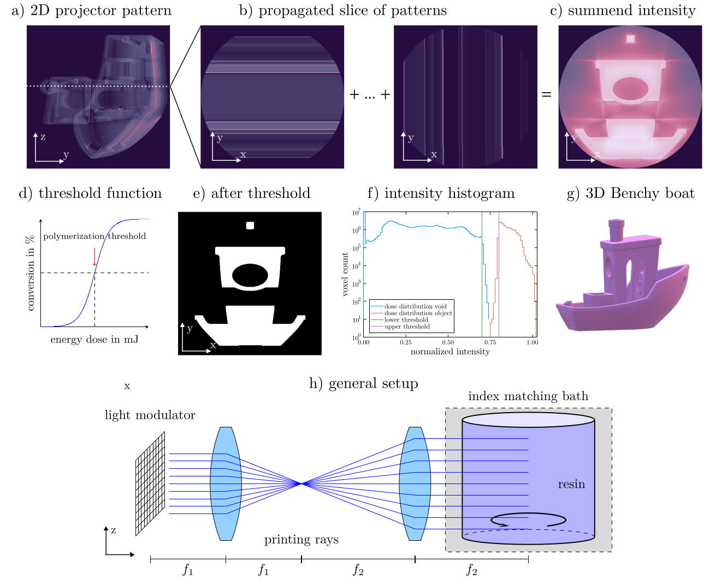

# SwissVAMyKnife.jl
[](https://github.com/EPFL-LAPD/SwissVAMyKnife.jl/actions/workflows/CI.yml) [](https://codecov.io/gh/EPFL-LAPD/SwissVAMyKnife.jl) [](https://roflmaostc.github.io/SwissVAMyKnife.jl/stable) [](https://roflmaostc.github.io/SwissVAMyKnife.jl/dev)

[Tomographic Volumetric Additive Manufacturing](https://www.youtube.com/watch?v=ONBHkzimRbg) is a novel 3D printing technique
which is based on a tomographic principle.
Light is illuminated from different angles onto a glass vial which contains a photosensitive resin.
Once a voxel in the resin receives enough light, polymerization starts.

This toolbox is developed to solve the optimization challenge around TVAM.
What are the required patterns on the projector such object voxels polymerize and not-object voxels stay unpolymerized?

This package is written in [Julia Lang](https://julialang.org/) and features CUDA and multithreaded CPU support. CUDA can accelerate reconstruction typically 10-20x times.

It runs on Windows, Linux and macOS!

# Background


The general principle behind TVAM. a) a set of 2D projection patterns is
propagated into space. b) shows how a slice of the pattern propagates through the
volume and c) how the incoherent sum results in a total energy dose. d) the object
polymerizes if it reaches an energy threshold. e) polymerization threshold results in a
printed slice. f) is the intensity histogram of b). g) is the 3D view of the Benchy boat.
h) is the general setup.


# Features
* 3D parallel Radon transform for ray optical simulation 
* rigorous simulation of absorption and vial refraction
* CUDA acceleration hence high performance
* 3D coherent wave optical optimization (see this [paper](https://arxiv.org/abs/2402.06283) for details and limitations). Note this has been only theoretical demonstrated and experimentally not validated.


# Installation
Install the most recent [Julia version](https://julialang.org/downloads/). Then open the REPL and run:
```julia
julia> using Pkg

julia> Pkg.add(url="github.com/EPFL-LAPD/SwissVAMyKnife.jl")
```

# Examples
You can also run the [examples](https://github.com/EPFL-LAPD/SwissVAMyKnife.jl/tree/main/examples) locally.
Download this repository and then do the following in your REPL:
```julia
julia> cd("examples/")

julia> using Pkg; Pkg.activate("."); Pkg.instantiate()
  Activating project at `~/.julia/dev/SwissVAMyKnife.jl/examples`

julia> using Pluto; Pluto.run()
```


# Other packages
There is the Python based [VAM Toolbox](https://github.com/computed-axial-lithography/VAMToolbox) and [LDCD-VAM](https://github.com/facebookresearch/LDCT-VAM/). 
In terms of functionality, they also offer a ray based methods including absorption.
Wave optical methods are not offered.

# Development
File an [issue](https://github.com/roflmaostc/RadonKA.jl/issues) on [GitHub](https://github.com/roflmaostc/RadonKA.jl) if you encounter any problems.
You can also join [my conference room](https://epfl.zoom.us/my/wechsler). Give me a minute to join!
If you need any help regarding TVAM in general, don't hesistate to contact us!

# Citation
If you use this software in academic work, please consider citing:
```bibtex
@misc{wechsler2024wave,
      title={Wave optical model for tomographic volumetric additive manufacturing},
      author={Felix Wechsler and Carlo Gigli and Jorge Madrid-Wolff and Christophe Moser},
      year={2024},
      eprint={2402.06283},
      archivePrefix={arXiv},
      primaryClass={physics.optics}
}
```
